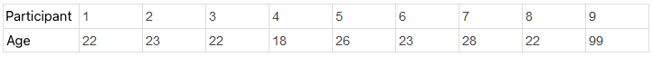

```{r, echo = FALSE, results = "hide"}
include_supplement("1641289742437en.png", recursive = TRUE)
```

Question
========
A trip leader asks the age (in years) of the nine participants of a group trip (see table below).  
He calculates three center measures (mode, median, and mean age).  
  
However, it turns out then the age of participant 9 is entered incorrectly: That should be "29," instead of "99." Which center measure or center measures will change because of this change?  
  


Answerlist
----------
* The median and mean will change.
* Both the mode, median, and mean will change.
* Only the mean will change.
* Only the median will change.
* The mode and the mean will change.
* Only the mode will change.

Solution
========

Answerlist
----------
* False
* False
* True
* False
* False
* False

Meta-information
================
exname: vufsw-measuresoflocation-0004-en
extype: schoice
exsolution: 001000
exshuffle: TRUE
exsection: descriptive statistics/summary statistics/measures of location
exextra[ID]: f5209
exextra[Type]: conceptual
exextra[Program]: calculator
exextra[Language]: English
exextra[Level]: statistical reasoning

