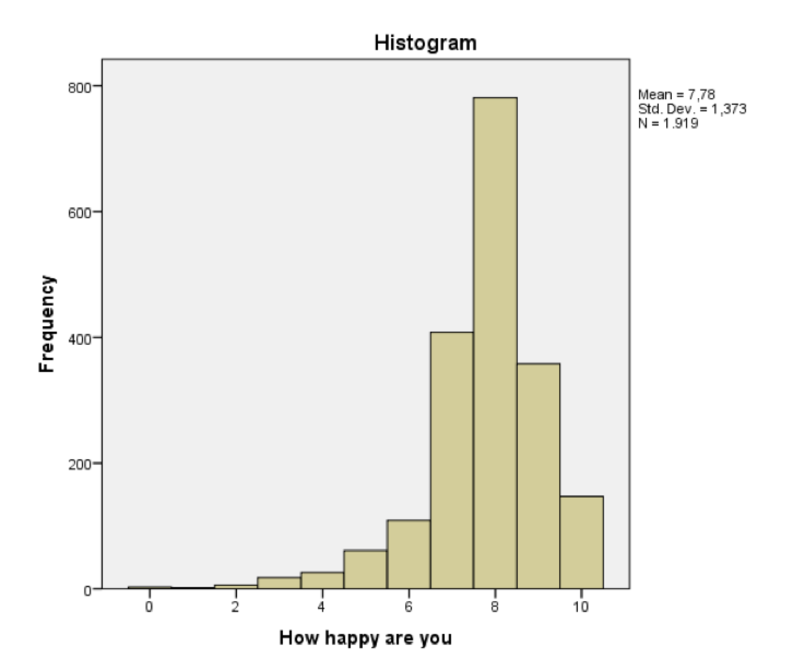

```{r, echo = FALSE, results = "hide"}
include_supplement("Screen__Shot__2019-02-21__at__00.20.09.png", recursive = TRUE)
```

Question
========
Hieronder vindt u een histogram van een maatstaf voor geluk die is gemaakt uit een willekeurige steekproef van 1919 inwoners van Nederland (bron:
* Uropean Social Survey, 2014*). Specifiek beantwoordden de respondenten de volgende vraag: "Alles bij elkaar genomen, hoe gelukkig zou u zeggen dat u gelukkig bent?". De antwoordmogelijkheden varieerden van "extreem ongelukkig" (0) tot "extreem gelukkig" (10).  
  

  
Is de verdeling van deze variabele rechtsscheef of linksscheef? Wat is de relatie van het gemiddelde met de mediaan en de modus van de verdeling?

Antwoordenlijst
----------
* De verdeling is links-scheef. Het gemiddelde is lager dan zowel de modus en de mediaan.
* De verdeling is links-scheef. Het gemiddelde is lager dan de modus maar maar hoger dan de mediaan.
* De verdeling is rechtsscheef. Het gemiddelde is lager dan de modus maar maar hoger dan de mediaan.
* De verdeling is rechtsscheef. Het gemiddelde is lager dan zowel de modus en de mediaan.

Solution
========

Taal Engels

Moeilijkheidsniveaus Gemakkelijk

M&T BIS Standaardwaarde

M&T Beschrijvende statistiek Standaardwaarde
Answerlist
----------
* Waar
* Onwaar
* Onwaar
* Onwaar

Meta-information
================
exname: vufsw-measuresoflocation-1076-nl
extype: schoice
exsolution: 1000
exshuffle: TRUE
exsection: descriptive statistics/summary statistics/measures of location
exextra[ID]: 7a9ca
exextra[Type]: conceptual
exextra[Program]: NA
exextra[Language]: Dutch
exextra[Level]: statistical literacy

