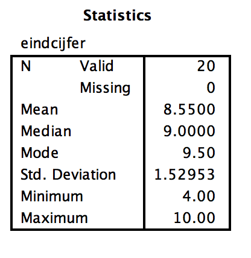

```{r, echo = FALSE, results = "hide"}
include_supplement("Screen__Shot__2019-03-24__at__01.47.52.png", recursive = TRUE)
```

Question
========
A diligent VU student notes her final grades obtained over the past academic years. At the VU, final grades are given on a scale ranging from 1 to 10. She analyzes these data with SPSS. This produces the descriptive statistics below.  
  
  
Judging from these data, the variable on the left seems to be skewed are ("skewed to the left"). TRUE can we infer this?   
  


Answerlist
----------
* The value of the mean is much smaller than the mode.
* The value of the standard deviation is much smaller than the mean.
* The value of the mean is more than 2 times the value of the standard deviation.
* The value of the standard deviation is much smaller than 1.96.
* The value of the standard deviation is much closer to the minimum score than to the maximum score.

Solution
========

When a variable appears to be skewed, then the values for the mean, median (middle number in the series) and the mode (the most common number in the series) from each other. For a variable that is normally distributed, the values of the mean, the median and the mode are nearly equal.  
  
In a skewed distributed histogram, the highest bar will represent the most common number, or the mode. The median, and subsequent next, the mean will always be a lower bar. If the mode in the series is one of the larger numbers, then most of the other numbers in the series will be smaller. As a result, for a histogram which is *left* skewed, the value of the mean will always be much
* Smaller** than that of the mode, because the other numbers in the series are smaller and therefore the mean is also smaller.

M&T ANOVA Default value
Answerlist
----------
* True
* False
* False
* False
* False

Meta-information
================
exname: vufsw-measuresofspread-0001-en
extype: schoice
exsolution: 10000
exshuffle: TRUE
exsection: descriptive statistics/summary statistics/measures of spread
exextra[Type]: conceptual
exextra[Program]: NA
exextra[Language]: English
exextra[Level]: statistical literacy

