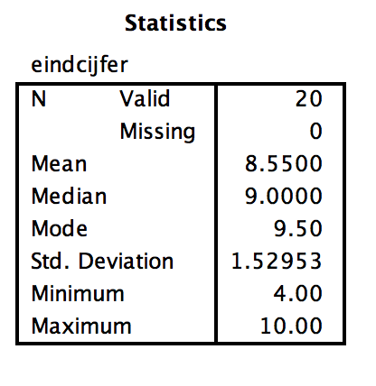

```{r, echo = FALSE, results = "hide"}
include_supplement("Screen__Shot__2019-03-24__at__01.47.52.png")
```

Question
========
Een ijverige VU studente noteert haar behaalde eindcijfers van de
afgelopen studiejaren. Op de VU worden eindcijfers gegeven op een schaal
die loopt van 1 t/m 10. Ze analyseert deze gegevens met SPSS. Dat levert
de onderstaande beschrijvende statistieken  op.  
  
  
Afgaande op deze gegevens lijkt de variabele links scheef verdeeld te
zijn (“skewed to the left”). Waar kunnen we dat uit afleiden?   
  


Answerlist
----------
* De waarde van het gemiddelde is veel kleiner dan de modus.
* De waarde van de standaarddeviatie is veel kleiner dan het gemiddelde.
* De waarde van het gemiddelde is meer dan 2 keer zo groot als de waarde
  van de standaarddeviatie.
* De waarde van de standaarddeviatie is veel kleiner dan 1,96.
* De waarde van de standaarddeviatie ligt veel dichter bij de minimum
  score dan bij de maximum score.

Solution
========


Wanneer een variabele scheef verdeeld lijkt te zijn, dan verschillen de
waarden voor het gemiddelde, de mediaan (middelste getal in de reeks) en
de modus (het meest voorkomende getal in de reeks) van elkaar. Bij een
variabele die normaal verdeeld is zijn de waarden van het gemiddelde, de
mediaan en de modus nagenoeg gelijk.  
  
Bij een scheef verdeelde histogram zal de hoogste bar het meest
voorkomende getal voorstellen, ofwel de modus. De mediaan, en daarop
volgend, het gemiddelde zal altijd een lagere bar zijn. Als de modus in
de reeks één van de grotere getallen is, dan zullen de meeste overige
getallen in de reeks kleiner zijn. Daardoor geldt dat voor een histogram
die *links *scheef verdeeld is, de waarde van het gemiddelde altijd veel
**kleiner** zal zijn dan die van de modus, omdat de overige getallen in
de reeks kleiner zijn en daardoor het gemiddelde ook kleiner is.


M&T ANOVA  
Standaardwaarde
Answerlist
----------
* True
* False
* False
* False
* False

Meta-information
================
exname: vufsw-measuresofspread-0001-nl
extype: schoice
exsolution: 10000
exshuffle: TRUE
exsection: descriptive statistics/summary statistics/measures of spread
exextra[Type]: conceptual
exextra[Program]: NA
exextra[Language]: Dutch
exextra[Level]: statistical literacy

