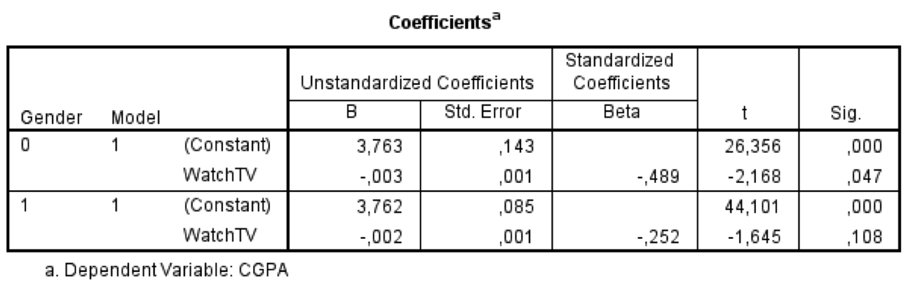

```{r, echo = FALSE, results = "hide"}
include_supplement("Untitled.png", recursive = TRUE)
```

Question
========
Below are the results of two separate regressions are shown (for women and men separately). "Gender" is a dummy variable that measures sex (0 = male; 1 = female). The dependent variable "CGPA" stands for one's *College Grade Point Average* and measures one's study performance on a scale from 2.5 (minimum score) to 4.0 (maximum score). "WatchTV" is a variable that indicates how many minutes per day a person typically spends watching TV.  
View the standard error ("*Std. Error*") of the b coefficient of "WatchTV". What does this number tell you?  
  


Answerlist
----------
* The SE(b) indicates the dispersion of the estimated effect of watching TV (X) on study performance (Y), if we were to take multiple samples.
* The SE(b) indicates the estimated value of Y (study performance), if X (TV watching) takes the value 0.
* The SE(b) indicates the extent to which the significance level used differs from the estimated effect of watching TV (X) on study performance (Y).
* The SE(b) indicates the estimated effect of watching TV (X) on study performance (Y) is, if we apply a standard correction for the systematic measurement errors of variables X and Y.

Solution
========

Language Dutch

Levels of Difficulty Easy

M&T Basics of quantitative research Basics of quantitative research

M&T BIS Default value
Answerlist
----------
* True
* False
* False
* False

Meta-information
================
exname: vufsw-measuresofspread-0035-en
extype: schoice
exsolution: 1000
exshuffle: TRUE
exsection: descriptive statistics/summary statistics/measures of spread
exextra[ID]: de70a
exextra[Type]: interpretation output
exextra[Program]: NA
exextra[Language]: English
exextra[Level]: statistical literacy

