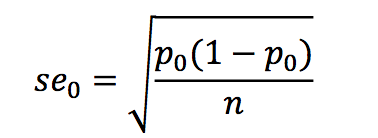

```{r, echo = FALSE, results = "hide"}
include_supplement("Screen__Shot__2019-03-22__at__23.57.43.png", recursive = TRUE)
include_supplement("Screen__Shot__2019-03-22__at__23.56.23.png", recursive = TRUE)
```

Question
========
Below are two formulas for calculating the standard error of the sampling distribution of a proportion, namely, respectively the standard error (se) and the exact standard error (se<sub>0</sub>). When do you use which formula?   
  

  


Answerlist
----------
* You use the standard error (se) when calculating a confidence interval and the exact standard error (se<sub>0</sub>) when testing a hypothesis.
* You use the standard error (se) when calculating a t-distribution and the exact standard error (se<sub>0</sub>) is used in the Standard Normal Distribution (the z-distribution).
* The standard error (se) you use for **sample** distribution and the exact standard error (se<sub>0</sub>) for the **sample** distribution.
* You use the standard error (se) for the alternative hypothesis (H<sub>a</sub>) and the exact standard error (se<sub>0</sub>) use for the null hypothesis (H<sub>0</sub>).
* You use the standard error (se) for a categorical variable and the exact standard error (se<sub>0</sub>) in the case of a quantitative variable.

Solution
========

Answerlist
----------
* True
* False
* False
* False
* False

Meta-information
================
exname: vufsw-measuresofspread-0069-en
extype: schoice
exsolution: 10000
exshuffle: TRUE
exsection: descriptive statistics/summary statistics/measures of spread
exextra[Type]: conceptual
exextra[Program]: NA
exextra[Language]: English
exextra[Level]: statistical reasoning

