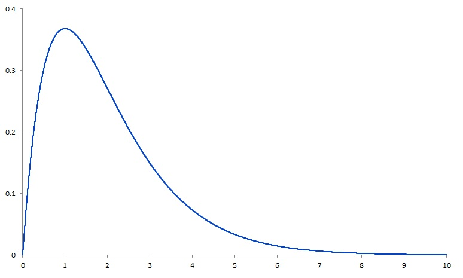

```{r, echo = FALSE, results = "hide"}
include_supplement("Skewed__distribution.jpg", recursive = TRUE)
```

Question
========
Seeing the distribution below, what can you conclude about the mode versus the mean and median?  
  
The scores on the X-axis represent the amount of time it takes to travel to travel to work (in hours).  
  
  


Answerlist
----------
* The mode has the lowest score (lowest number of hours) of the three magnitudes.
* The median has a lower score (lower number of hours) than the mode.
* The mean's score is lower (number of hours is lower) than the score of the mode.
* Both the median and the mean have lower scores (a lower number of hours) than the mode.

Solution
========

Answerlist
----------
* True
* False
* False
* False

Meta-information
================
exname: vufsw-mode-0024-en
extype: schoice
exsolution: 1000
exshuffle: TRUE
exsection: descriptive statistics/summary statistics/measures of location/mode
exextra[Type]: conceptual
exextra[Program]: NA
exextra[Language]: English
exextra[Level]: statistical literacy

