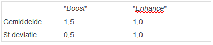

```{r, echo = FALSE, results = "hide"}
include_supplement("1641291934883.png", recursive = TRUE)
```

Question
========
In one research project, researchers compared two tutoring programs. Students were randomly assigned to one of the two tutoring programs.  
The table below shows:  Students who received tutoring program "*Boost*" scored, on average, a grade of 1.5 points higher than before they entered the tutoring program began, with a standard deviation of 0.5.  
  
Students who received tutoring program "*Enhance*" scored on average a grade of 1.0 points higher than before they began the tutoring program started, with a standard deviation of 1.0.  
  
In which program was there *more variation* in the increase in grades?  
   


Answerlist
----------
* In the tutoring program "*Enhance*", because the standard deviation is closer to the mean score there.
* In the tutoring program "*Boost*", because the standard deviation there is smaller.
* In the tutoring program "*Enhance*", because the standard deviation there is larger.
* In the tutoring program "*Boost*", because the standard deviation there is closer to the mean score.

Solution
========

Answerlist
----------
* False
* False
* True
* False

Meta-information
================
exname: vufsw-standarddeviation-0049-en
extype: schoice
exsolution: 0010
exshuffle: TRUE
exsection: descriptive statistics/summary statistics/measures of spread/standard deviation
exextra[Type]: conceptual
exextra[Program]: NA
exextra[Language]: English
exextra[Level]: statistical literacy

