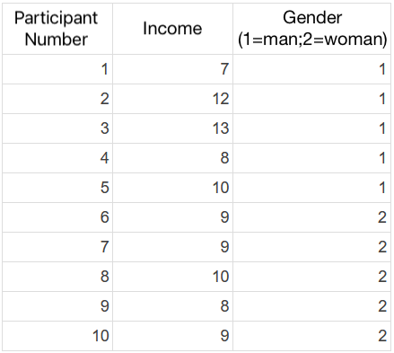

```{r, echo = FALSE, results = "hide"}
include_supplement("1643020221452en.png", recursive = TRUE)
```

Question
========
Below is a table of income data for a sample consisting of 12 women and men (1=man; 2 =woman)  In which group is the **standard deviation** (SD) of the variable "**income**" greatest, among men or among women? And from what can you infer this?  
  


Answerlist
----------
* The standard deviation is higher among males because the scores are among this group further away from the mean of this group.
* The standard deviation is higher among females, because the scores in this group further away from the mean of this group.
* The standard deviation is higher among the women, because the mean score of the women is much lower than the average score of the men.
* The standard deviation is higher among the men, because the mean score of the men is much higher than the mean score of the women.
* The standard deviation is higher among men because the median score (median) of the men is much higher than the mean score (median) of the women.

Solution
========

Answerlist
----------
* True
* False
* False
* False
* False

Meta-information
================
exname: vufsw-standarddeviation-0163-en
extype: schoice
exsolution: 10000
exshuffle: TRUE
exsection: descriptive statistics/summary statistics/measures of spread/standard deviation
exextra[ID]: da794
exextra[Type]: calculation
exextra[Program]: calculator
exextra[Language]: English
exextra[Level]: statistical thinking

