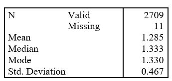

```{r, echo = FALSE, results = "hide"}
include_supplement("uu-distributions-001-en-table.JPG", recursive = TRUE)
```

Question
========
  
Een gemiddelde over alle 12 vragen op een autonomievragenlijst werd verkregen om gebruikt te worden als autonomiescore. SPSS werd gebruikt om de volgende beschrijvende statistieken te verkrijgen: 



Wat kun je zeggen over de vorm van de verdeling van autonomiescores? 
Answerlist
----------
* Waarschijnlijk een symmetrische verdeling.
* Waarschijnlijk een zeer negatief scheve verdeling.
* Waarschijnlijk een zeer positief scheve verdeling.
* Waarschijnlijk een bimodale verdeling.

Solution
========
  

Answerlist
----------
* Dit antwoord is juist.
* Dit antwoord is onjuist.
* Dit antwoord is onjuist.
* Dit antwoord is onjuist.

Meta-information
================
exname: uu-distributions-001-nl
extype: schoice
exsolution: 1000
exsection: Distributions
exextra[Type]: Conceptual
exextra[Program]: 
exextra[Language]: Dutch
exextra[Level]: Statistical Literacy
