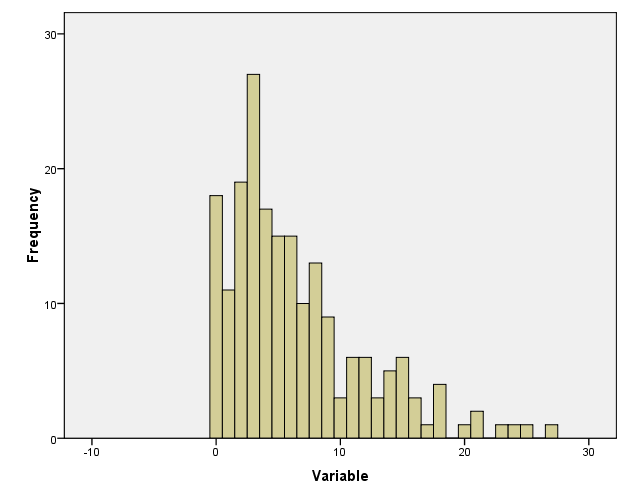

```{r, echo = FALSE, results = "hide"}
include_supplement("uu-distributions-002-en-graph.png", recursive = TRUE)
```

Question
========
  
De verdeling van de scores wordt weergegeven in een histogram. 



De distributie is...

Answerlist
----------
* Symmetrisch.
* Positief scheef.
* Negatief scheef.
* Bimodaal.

Solution
========
  

Answerlist
----------
* De verdeling is niet symmetrisch.
* Dit antwoord is juist.
* Dit antwoord is onjuist. De verdeling is scheef, maar in welke richting is de scheefheid?
* Dit antwoord is onjuist.

Meta-information
================
exname: uu-distributions-002-nl
extype: schoice
exsolution: 0100
exsection: Distributions
exextra[Type]: Conceptual
exextra[Program]: 
exextra[Language]: Dutch
exextra[Level]: Statistical Literacy
