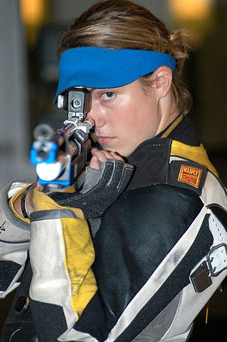

```{r, echo = FALSE, results = "hide"}
include_supplement("uva-binomial-1053-nl-graph01.jpeg", recursive = TRUE)
```

Question
========

Marieke is a shooter. The probability of hitting a target with a shot is 0.1. In a match, she has shot 5 times. What is the probability that she successfully hit the target at least once? We assume that each shot is independent of each other.



Answerlist
----------

* 0,10
* 0,41
* 0,50
* 0,59

Solution
========

Answerlist
----------

* 0.10: Incorrect
* 0.41: Correct
* 0.50: Incorrect
* 0.59: Incorrect

Meta-information
================
exname: uva-binomial-1053-en
extype: schoice
exsolution: 0100
exsection: Distributions/Discrete/Binomial
exextra[Type]: Conceptual
exextra[Language]: English
exextra[Level]: Statistical Literacy
exextra[IRT-Difficulty]: 2.309
exextra[p-value]: 0.4889
