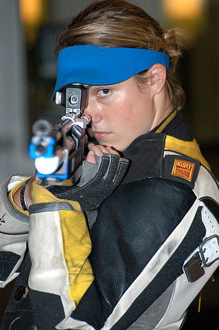

```{r, echo = FALSE, results = "hide"}
include_supplement("uva-binomial-1053-nl-graph01.jpeg", recursive = TRUE)
```

Question
========

Marieke is een schutter. De kans op het raken van een doel met een schot
is 0,1. In een wedstrijd heeft zij 5 keer geschoten. Wat is de kans dat
zij minstens één keer succesvol het doel raakt? We nemen aan dat elk
schot onafhankelijk van elkaar is.



Answerlist
----------

* 0,10
* 0,41
* 0,50
* 0,59

Solution
========

Het correcte antwoord is: 

* 0,41

Meta-information
================
exname: uva-binomial-1053-nl
extype: schoice
exsolution: 0100
exsection: Distributions/Discrete/Binomial
exextra[Type]: Conceptual
exextra[Language]: Dutch
exextra[Level]: Statistical Literacy
exextra[IRT-Difficulty]: 2.309
exextra[p-value]: 0.4889
