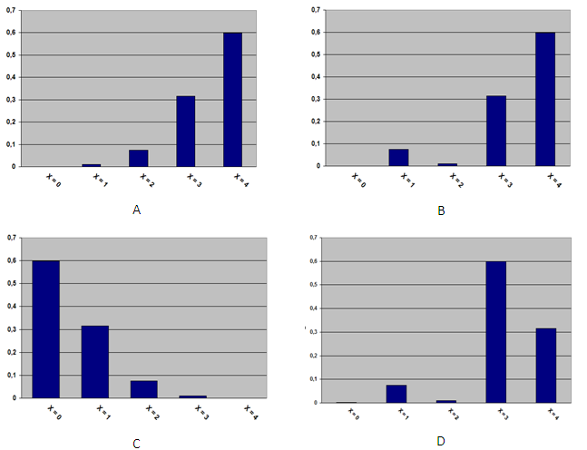

```{r, echo = FALSE, results = "hide"}
include_supplement("uva-binomial-1058-nl-graph01.png", recursive = TRUE)
```

Question
========

5% of the screws produced are defective and the quality of the screws is independent of each other. Suppose *X* is the number of defective screws and you pick 10 screws as a sample. Below you will see several diagrams. Which diagram shows the correct probability distribution belonging to *X* = 0, ..., 4?



Answerlist
----------

* A
* B
* C
* D

Solution
========

Answerlist
----------

* A: Incorrect
* B: Incorrect
* C: Correct
* D: Incorrect

Meta-information
================
exname: uva-binomial-1058-en
extype: schoice
exsolution: 0010
exsection: Distributions/Discrete/Binomial
exextra[ID]: d67ee
exextra[Type]: Conceptual
exextra[Language]: English
exextra[Level]: Statistical Literacy
exextra[IRT-Difficulty]: 2
exextra[p-value]: 0.5905
