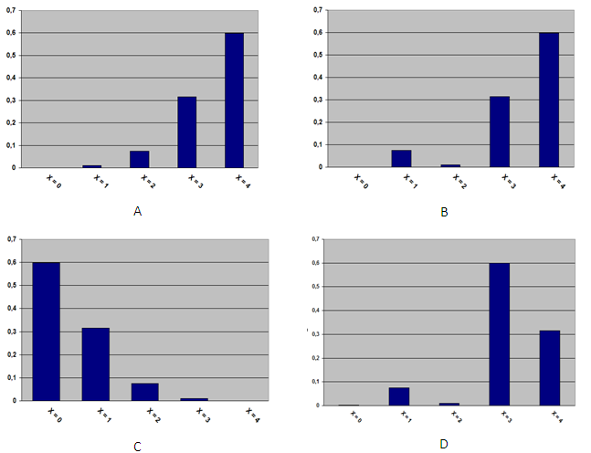

```{r, echo = FALSE, results = "hide"}
include_supplement("uva-binomial-1058-nl-graph01.png", recursive = TRUE)
```

Question
========

5% van de geproduceerde schroeven is defect en de kwaliteit van de
schroeven is onafhankelijk van elkaar. Stel *X* is het aantal defecte
schroeven en je pakt 10 schroeven als een steekproef. Hieronder zie je
verschillende diagrammen. Welk diagram toont de correcte kansverdeling
behorend bij *X* = 0, \..., 4?



Answerlist
----------

* A
* B
* C
* D

Solution
========

Answerlist
----------

* A: Incorrect
* B: Incorrect
* C: Correct
* D: Incorrect

Meta-information
================
exname: uva-binomial-1058-nl
extype: schoice
exsolution: 0010
exsection: Distributions/Discrete/Binomial
exextra[ID]: a35fd
exextra[Type]: Conceptual
exextra[Language]: Dutch
exextra[Level]: Statistical Literacy
exextra[IRT-Difficulty]: 2
exextra[p-value]: 0.5905
