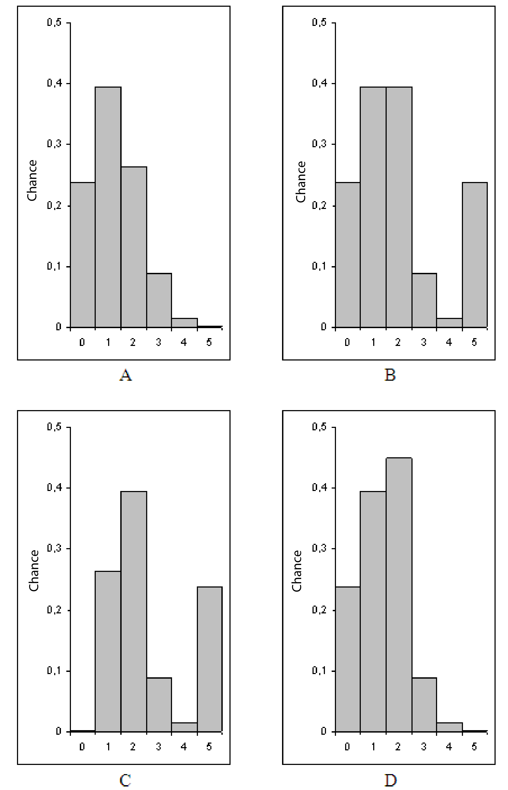

```{r, echo = FALSE, results = "hide"}
include_supplement("uva-binomial-758-en-graph01.png", recursive = TRUE)
```

Question
========

Genetics teaches that children inherit genes from their parents. If both parents carry the genes O and A for blood type, each child has a chance of 0.25 to inherit two O genes to become blood type O. The number of children with blood type O among five offspring of these parents is the number of successes *X* in five independent attempts. Suppose that random variable X is the number of children with blood type O, so *X* has the values as 0, 1, TRUE. , 5 and the *Binomial* (5, 0.25)-distribution. Which diagram below shows the probability of each value of *X*?



Answerlist
----------

* A
* B
* C
* D

Solution
========

Answerlist
----------

* A: Correct
* B: Incorrect
* C: Incorrect
* D: Incorrect

Meta-information
================
exname: uva-binomial-758-en
extype: schoice
exsolution: 1000
exsection: Distributions/Discrete/Binomial
exextra[Type]: Conceptual
exextra[Language]: English
exextra[Level]: Statistical Literacy
exextra[IRT-Difficulty]: 2
exextra[p-value]: 0.5905
