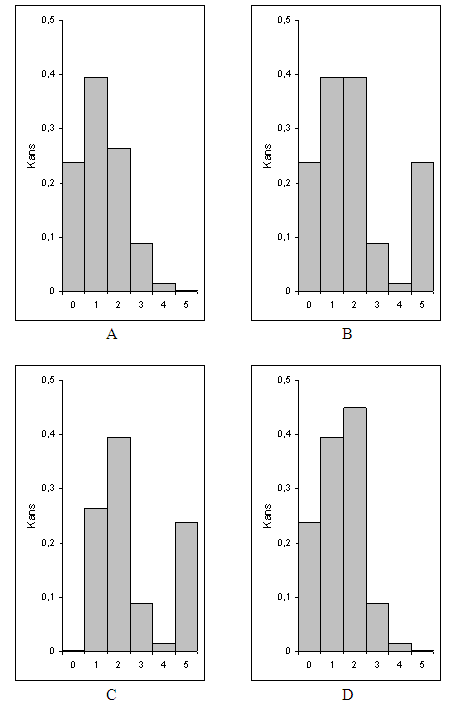

```{r, echo = FALSE, results = "hide"}
include_supplement("uva-binomial-758-nl-graph01.png", recursive = TRUE)
```

Question
========

De genetica leert dat kinderen genen erven van hun ouders. Als beide
ouders de genen O en A voor bloedgroep dragen, heeft elke kind een kans
van 0,25 om twee O-genen te erven en zo bloedgroep O te krijgen. Het
aantal kinderen met bloedgroep O onder vijf nakomelingen van deze ouders
is het aantal successen *X* in vijf onafhankelijke pogingen. Stel dat
toevalsvariabele X het aantal kinderen is met bloedgroep O, dus *X*
heeft de waarden als 0, 1, \... , 5 en de *Binomiaal* (5,
0,25)-verdeling. Welk diagram hieronder geeft de kans op elke waarde van *X* aan?



Answerlist
----------

* A
* B
* C
* D

Solution
========

Answerlist
----------

* A: Correct
* B: Incorrect
* C: Incorrect
* D: Incorrect

Meta-information
================
exname: uva-binomial-758-nl
extype: schoice
exsolution: 1000
exsection: Distributions/Discrete/Binomial
exextra[ID]: 850a6
exextra[Type]: Conceptual
exextra[Language]: Dutch
exextra[Level]: Statistical Literacy
exextra[IRT-Difficulty]: 2
exextra[p-value]: 0.5905
