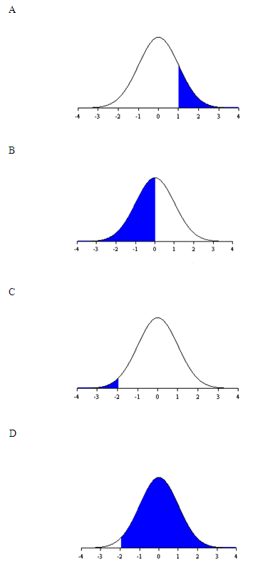

```{r, echo = FALSE, results = "hide"}
include_supplement("uva-normal-1321-nl-graph01.png", recursive = TRUE)
```

Question
========

Suppose *z* is normally distributed with a mean 0 and variance 1. Which colored area of the graph below represents the probability of *z* ≥ - 1.96 represent?



Answerlist
----------

* A
* B
* C
* D

Solution
========

Answerlist
----------

* A: Incorrect
* B: Correct
* C: Incorrect
* D: Incorrect

Meta-information
================
exname: uva-normal-1321-en
extype: schoice
exsolution: 0100
exsection: Distributions/Continuous/Normal
exextra[Type]: Conceptual
exextra[Language]: English
exextra[Level]: Statistical Literacy
exextra[IRT-Difficulty]: 1
exextra[p-value]: 0.8912
