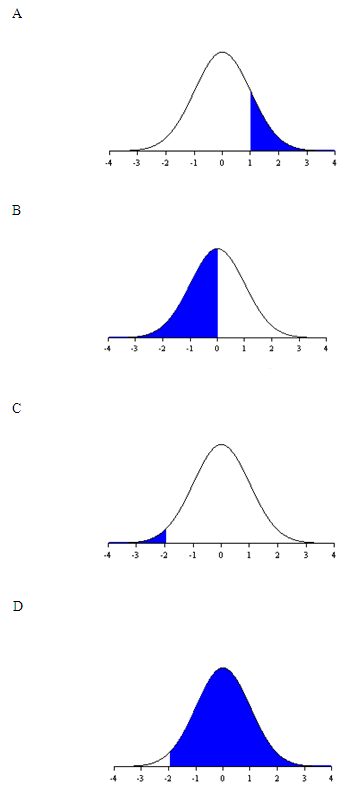

```{r, echo = FALSE, results = "hide"}
include_supplement("uva-normal-1321-nl-graph01.png", recursive = TRUE)
```

Question
========

Stel *z* is normaal verdeeld met een gemiddelde 0 en een variantie 1.
Welk gekleurd oppervlak van de grafiek hieronder geeft de kans op *z*
≥ - 1,96 weer?



Answerlist
----------

* A
* B
* C
* D

Solution
========

Het correcte antwoord is: 

* B

Meta-information
================
exname: uva-normal-1321-nl
extype: schoice
exsolution: 0100
exsection: Distributions/Continuous/Normal
exextra[Type]: Conceptual
exextra[Language]: Dutch
exextra[Level]: Statistical Literacy
exextra[IRT-Difficulty]: 1
exextra[p-value]: 0.8912
