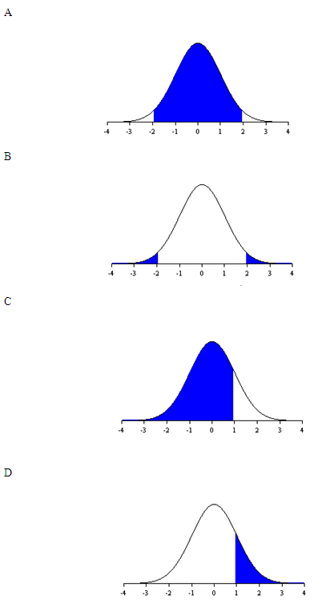

```{r, echo = FALSE, results = "hide"}
include_supplement("uva-normal-1322-nl-graph01.png", recursive = TRUE)
```

Question
========

*z* is normaal verdeeld met een gemiddelde 0 en een variantie 1. Welk
gekleurd oppervlak van de grafiek hieronder geeft de kans op - 1,96 ≤ *z* ≥ 1,96 weer?



Answerlist
----------

* A
* B
* C
* D

Solution
========

Answerlist
----------

* A: Correct
* B: Incorrect
* C: Incorrect
* D: Incorrect

Meta-information
================
exname: uva-normal-1322-nl
extype: schoice
exsolution: 1000
exsection: Distributions/Continuous/Normal
exextra[Type]: Conceptual
exextra[Language]: Dutch
exextra[Level]: Statistical Literacy
exextra[IRT-Difficulty]: 0.717
exextra[p-value]: 0.8984
