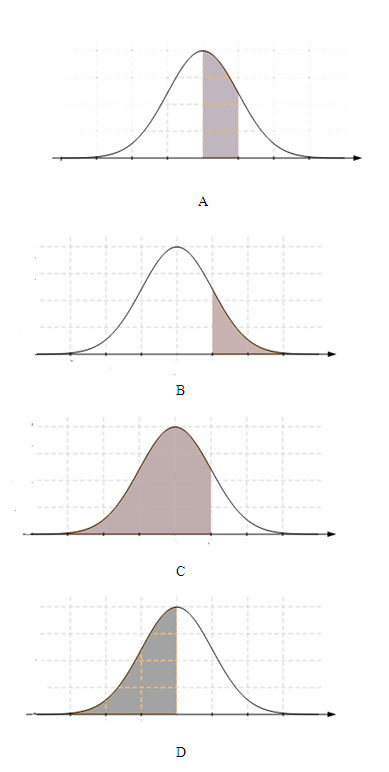

```{r, echo = FALSE, results = "hide"}
include_supplement("uva-normal-1338-nl-graph01.png", recursive = TRUE)
```

Question
========

Vind het gebied onder de standaardnormale kromme in het volgende geval:
tussen z = 0,0 en z = 0,74.



Answerlist
----------

A
B
C
D

Solution
========

Answerlist
----------

A: Correct
B: Incorrect
C: Incorrect
D: Incorrect

Meta-information
================
exname: uva-normal-1338-nl
extype: schoice
exsolution: 1000
exsection: Distributions/Continuous/Normal
exextra[Type]: Conceptual
exextra[Language]: Dutch
exextra[Level]: Statistical Literacy
exextra[IRT-Difficulty]: 1.174
exextra[p-value]: 0.8829
