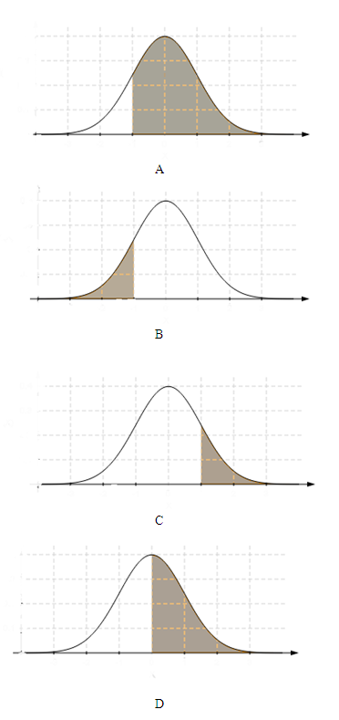

```{r, echo = FALSE, results = "hide"}
include_supplement("uva-normal-1339-nl-graph01.png", recursive = TRUE)
```

Question
========

Find the area under the standard normal curve in the following case: to the right of z = -1.28



Answerlist
----------

* A
* B
* C
* D

Solution
========

Answerlist
----------

* A: Correct
* B: Incorrect
* C: Incorrect
* D: Incorrect

Meta-information
================
exname: uva-normal-1339-en
extype: schoice
exsolution: 1000
exsection: Distributions/Continuous/Normal
exextra[Type]: Conceptual
exextra[Language]: English
exextra[Level]: Statistical Literacy
exextra[IRT-Difficulty]: 1.528
exextra[p-value]: 0.8571
