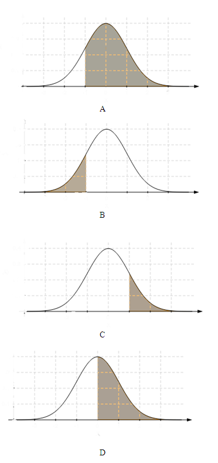

```{r, echo = FALSE, results = "hide"}
include_supplement("uva-normal-1339-nl-graph01.png", recursive = TRUE)
```

Question
========

Vind het gebied onder de standaardnormale kromme in het volgende geval:
rechts van z = -1,28



Answerlist
----------

* A
* B
* C
* D

Solution
========

Het correcte antwoord is: 

* A

Meta-information
================
exname: uva-normal-1339-nl
extype: schoice
exsolution: 1000
exsection: Distributions/Continuous/Normal
exextra[Type]: Conceptual
exextra[Language]: Dutch
exextra[Level]: Statistical Literacy
exextra[IRT-Difficulty]: 1.528
exextra[p-value]: 0.8571
