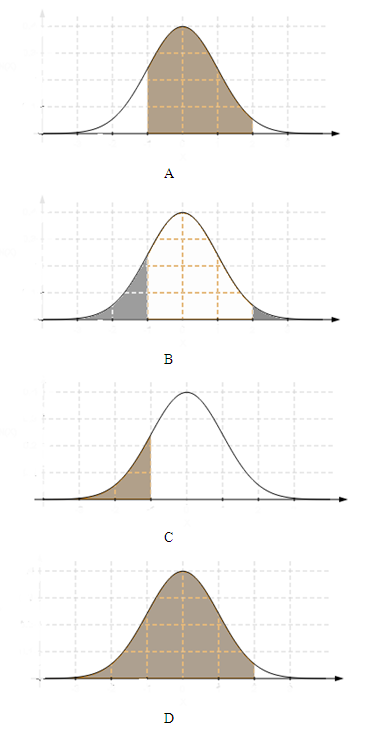

```{r, echo = FALSE, results = "hide"}
include_supplement("uva-normal-1340-nl-graph01.png", recursive = TRUE)
```

Question
========

Find the area under the standard normal curve in the following case: To the right of z = 2.05 or to the left of z = -1.44



Answerlist
----------

* A
* B
* C
* D

Solution
========

Answerlist
----------

* A: Incorrect
* B: Correct
* C: Incorrect
* D: Incorrect

Meta-information
================
exname: uva-normal-1340-en
extype: schoice
exsolution: 0100
exsection: Distributions/Continuous/Normal
exextra[Type]: Conceptual
exextra[Language]: English
exextra[Level]: Statistical Literacy
exextra[IRT-Difficulty]: 0.339
exextra[p-value]: 0.9154
