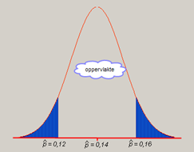

```{r, echo = FALSE, results = "hide"}
include_supplement("uva-normal-647-nl-graph01.png", recursive = TRUE)
```

Question
========

Research shows that in the event of fraud, only 14% of the students who see it would report it to teachers. The proportion *p*
= 0.14 is a parameter that describes the population of all students. The proportion $\hat{p}$ of the sample is a given in order to *p* estimate in the study and that is a pure estimate. We take a sample of 600 students. Then $\hat{p}$ normally distributed with an expectation of 0.14 and a standard deviation of 0.016. What is the probability that the result of the study will be more than two percentage points different from the true population, i.e., the probability of
$\hat{p}$<0.12 or $\hat{p}$\>0,16?



Answerlist
----------

* About 14%
* About 21%
* About 79%
* About 80%

Solution
========

Answerlist
----------

* About 14%: Incorrect
* About 21%: Incorrect
* About 79%: Correct
* About 80%: Incorrect

Meta-information
================
exname: uva-normal-647-en
extype: schoice
exsolution: 0010
exsection: Distributions/Continuous/Normal
exextra[Type]: Conceptual
exextra[Language]: English
exextra[Level]: Statistical Literacy
exextra[IRT-Difficulty]: 2.94
exextra[p-value]: 0.409
