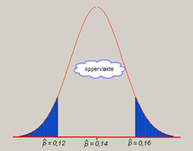

```{r, echo = FALSE, results = "hide"}
include_supplement("uva-normal-647-nl-graph01.png", recursive = TRUE)
```

Question
========

Uit onderzoek blijkt dat in geval van fraude slechts 14% van de
studenten die dit zien dit aan docenten zou doorgeven. De proportie *p*
= 0,14 is een parameter die de populatie van alle studenten beschrijft.
De proportie $\hat{p}$ van de steekproef is een gegeven om *p* te
schatten in het onderzoek en dat is een zuivere schatting. We nemen een
steekproef van 600 studenten. Dan is $\hat{p}$ normaal verdeeld met
een verwachting van 0,14 en een standaarddeviatie van 0,016. Wat is de
kans dat het resultaat van het onderzoek meer dan twee procentpunten
verschilt van de werkelijke populatie, dus de kans op
$\hat{p}$\<0,12 of $\hat{p}$\>0,16?



Answerlist
----------

* Ongeveer 14%
* Ongeveer 21%
* Ongeveer 79%
* Ongeveer 80%

Solution
========

Answerlist
----------

* Ongeveer 14%: Incorrect
* Ongeveer 21%: Incorrect
* Ongeveer 79%: Correct
* Ongeveer 80%: Incorrect

Meta-information
================
exname: uva-normal-647-nl
extype: schoice
exsolution: 0010
exsection: Distributions/Continuous/Normal
exextra[Type]: Conceptual
exextra[Language]: Dutch
exextra[Level]: Statistical Literacy
exextra[IRT-Difficulty]: 2.94
exextra[p-value]: 0.409
