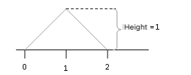

```{r, echo = FALSE, results = "hide"}
include_supplement("uva-uniform-1319-en-graph01.png", recursive = TRUE)
```

Question
========

Suppose the continuous stochastic variable X is: any value between 0 and 2. The density curve of X is shown below._____________. What is the probability that X is less than 0.5?



Answerlist
----------

* 0,1
* 0,13
* 0,25
* 0,5

Solution
========

Answerlist
----------

* 0.1: Incorrect
* 0.13: Correct
* 0.25: Incorrect
* 0.5: Incorrect

Meta-information
================
exname: uva-uniform-1319-en
extype: schoice
exsolution: 0100
exsection: Distributions/Continuous/Uniform
exextra[ID]: b3661
exextra[Type]: Conceptual
exextra[Language]: English
exextra[Level]: Statistical Literacy
exextra[IRT-Difficulty]: 2
exextra[p-value]: 0.5905
