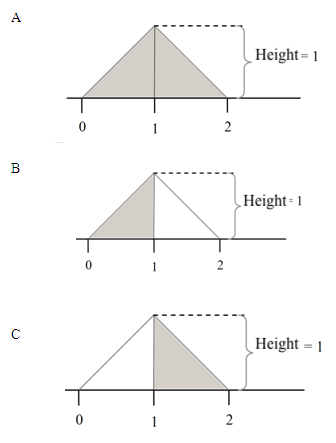

```{r, echo = FALSE, results = "hide"}
include_supplement("uva-uniform-1325-en-graph01.png", recursive = TRUE)
```

Question
========

Which shaded area in the drawing below has a probability that X is less than 1?



Answerlist
----------

* A
* B
* C

Solution
========

Answerlist
----------

* A: Incorrect
* B: Correct
* C: Incorrect

Meta-information
================
exname: uva-uniform-1325-en
extype: schoice
exsolution: 010
exsection: Distributions/Continuous/Uniform
exextra[ID]: ca5c8
exextra[Type]: Conceptual
exextra[Language]: English
exextra[Level]: Statistical Literacy
exextra[IRT-Difficulty]: 2
exextra[p-value]: 0.5905
