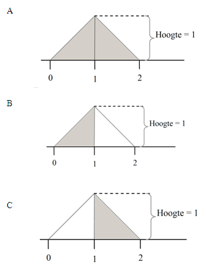

```{r, echo = FALSE, results = "hide"}
include_supplement("uva-uniform-1325-nl-graph01.png", recursive = TRUE)
```

Question
========

Welk gearceerd oppervlak in de tekening hieronder heeft een kans dat X
kleiner is dan 1?



Answerlist
----------

* A
* B
* C

Solution
========

Het correcte antwoord is: 

* B

Meta-information
================
exname: uva-uniform-1325-nl
extype: schoice
exsolution: 010
exsection: Distributions/Continuous/Uniform
exextra[Type]: Conceptual
exextra[Language]: Dutch
exextra[Level]: Statistical Literacy
exextra[IRT-Difficulty]: 2
exextra[p-value]: 0.5905
