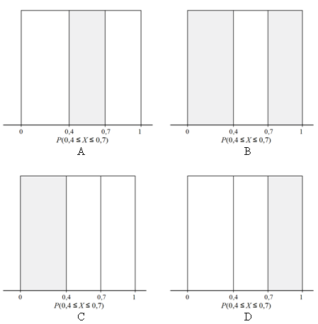

```{r, echo = FALSE, results = "hide"}
include_supplement("uva-uniform-711-nl-graph01.png", recursive = TRUE)
```

Question
========

A generator of random numbers in a computer will spread its outcomes spread evenly over the entire interval from 0 to 1 when we make it generate a long series of numbers. We call this a so-called *uniform distribution*. A generator of random numbers produces a number X that lies between 0 and 0.4. Which gray shaded area(s) in the drawing below assigns the probability P(0.4 ≤ *X* ≤ 0.7) assigns?



Answerlist
----------

* A
* B
* C
* D

Solution
========

Answerlist
----------

* A: Correct
* B: Incorrect
* C: Incorrect
* D: Incorrect

Meta-information
================
exname: uva-uniform-711-en
extype: schoice
exsolution: 1000
exsection: Distributions/Continuous/Uniform
exextra[ID]: 6b726
exextra[Type]: Conceptual
exextra[Language]: English
exextra[Level]: Statistical Literacy
exextra[IRT-Difficulty]: 2
exextra[p-value]: 0.5905
