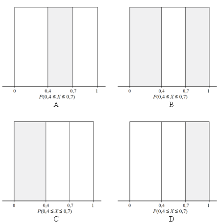

```{r, echo = FALSE, results = "hide"}
include_supplement("uva-uniform-711-nl-graph01.png", recursive = TRUE)
```

Question
========

Een generator van toevalsgetallen in een computer zal zijn uitkomsten
gelijkmatig verspreiden over het hele interval van 0 tot 1 wanneer wij
deze een lange serie getallen laten genereren. Dit noemen we een
zogenaamde *uniforme verdeling*. Een generator van toevalsgetallen
produceert een getal X dat tussen 0 en 0,4 ligt. Welk grijs gearceerde
oppervlakte(n) in de tekening hieronder kent de kans P(0,4 ≤ *X* ≤ 0,7)
toe?



Answerlist
----------

A
B
C
D

Solution
========

Answerlist
----------

A: Correct
B: Incorrect
C: Incorrect
D: Incorrect

Meta-information
================
exname: uva-uniform-711-nl
extype: schoice
exsolution: 1000
exsection: Distributions/Continuous/Uniform
exextra[Type]: Conceptual
exextra[Language]: Dutch
exextra[Level]: Statistical Literacy
exextra[IRT-Difficulty]: 2
exextra[p-value]: 0.5905
