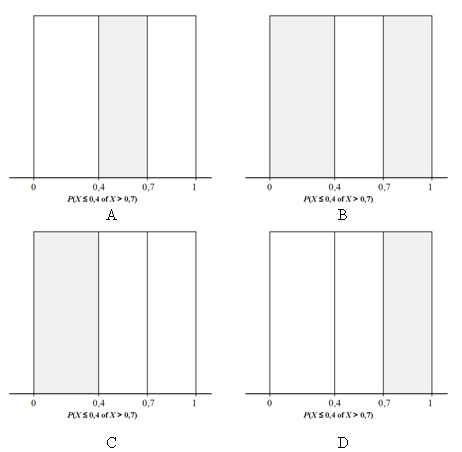

```{r, echo = FALSE, results = "hide"}
include_supplement("uva-uniform-713-nl-graph01.png", recursive = TRUE)
```

Question
========

A generator of random numbers in a computer will spread its outcomes spread evenly over the entire interval from 0 to 1 when we make it generate a long series of numbers. We call this a so-called *uniform distribution*. A generator of random numbers produces a number *X* that lies in an interval 0.4 or in an interval 0,7. Which gray shaded area(s) does the probability P(*X* ≤ 0.4 or *X* \> 0.7) assign?



Answerlist
----------

* A
* B
* C
* D

Solution
========

Answerlist
----------

* A: Incorrect
* B: Correct
* C: Incorrect
* D: Incorrect

Meta-information
================
exname: uva-uniform-713-en
extype: schoice
exsolution: 0100
exsection: Distributions/Continuous/Uniform
exextra[ID]: b6958
exextra[Type]: Conceptual
exextra[Language]: English
exextra[Level]: Statistical Literacy
exextra[IRT-Difficulty]: 2
exextra[p-value]: 0.5905
