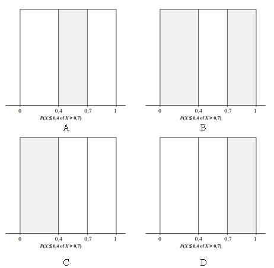

```{r, echo = FALSE, results = "hide"}
include_supplement("uva-uniform-713-nl-graph01.png", recursive = TRUE)
```

Question
========

Een generator van toevalsgetallen in een computer zal zijn uitkomsten
gelijkmatig verspreiden over het hele interval van 0 tot 1 wanneer wij
deze een lange serie getallen laten genereren. Dit noemen we een
zogenaamde *uniforme verdeling*. Een generator van toevalsgetallen
produceert een getal *X* dat ligt in een interval 0,4 of in een interval
0,7. Welk grijs gearceerde oppervlakte(n) kent de kans P(*X* ≤ 0,4 of *X* \> 0,7) toe?



Answerlist
----------

A
B
C
D

Solution
========

Answerlist
----------

A: Incorrect
B: Correct
C: Incorrect
D: Incorrect

Meta-information
================
exname: uva-uniform-713-nl
extype: schoice
exsolution: 0100
exsection: Distributions/Continuous/Uniform
exextra[Type]: Conceptual
exextra[Language]: Dutch
exextra[Level]: Statistical Literacy
exextra[IRT-Difficulty]: 2
exextra[p-value]: 0.5905
