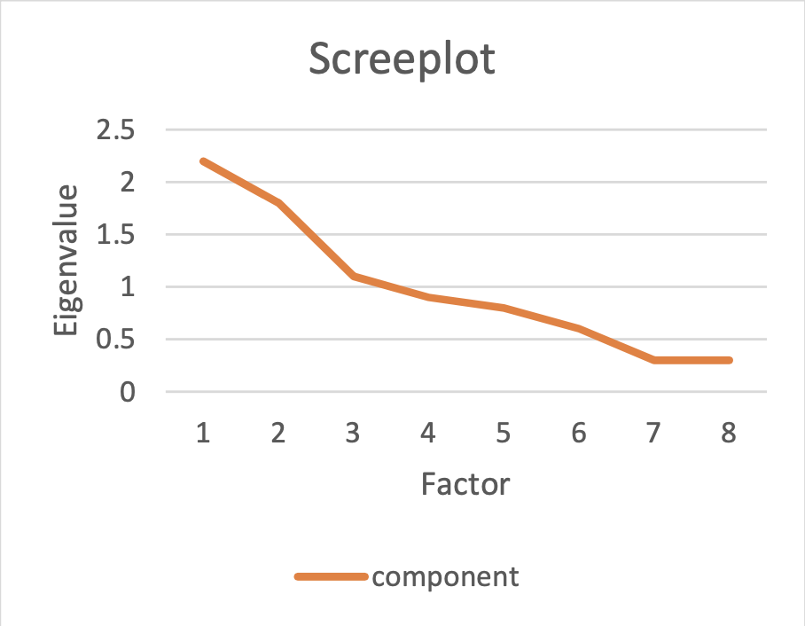

```{r, echo = FALSE, results = "hide"}
#Load package
library(knitr)

# add picture
include_supplement("EUR-Factor-102-ENG-img102.png", recursive = TRUE)
```

Question
========
Hieronder vindt u de resultaten van een factoranalyse van 8 items die mutuisme meten, samen met de bijbehorende screeplot.

```{r, echo=FALSE}
library(knitr)
Factor <- 1:8
Total <- c(2.2, 1.8, 1.1, 0.9, 0.8, "...", 0.3, 0.3)
table <- cbind(Factor, Total)
kable(table)
```



Hoeveel factoren zou je kiezen op basis van de tabel en de screeplot?


Solution
========
Op basis van de screeplot zou men twee factoren moeten kiezen. Er zijn echter drie factoren met eigenwaarden groter dan 1; op basis van het kaisercriterium zou je voor drie factoren moeten gaan. Dit laatste criterium houdt echter geen rekening met het feit dat tests met een groter aantal items meer kans hebben op eigenwaarden groter dan 1 in vergelijking met tests met een kleiner aantal tests, zelfs als deze twee tests tot doel hebben dezelfde constructen te meten. Tussen deze twee opties is het baseren van de beslissing op de verschillen in eigenwaarden en de scree plot de voorkeursoptie (2 factoren), maar het is moeilijk om te beslissen hoeveel factoren we moeten kiezen zonder theorie of informatie over de interpreteerbaarheid van de factoren.

Meta-information
================
exname: eur-factor-102-nl
extype: num
exsolution: 2
extol: 0
exsection: Factor analysis/Scree plot, Factor analysis/Exploratory factor analysis, Factor analysis/Eigenvalues, Factor analysis/Explained variance
exextra[ID]: 905c8
exextra[Type]: Interpreting graph
exextra[Program]: 
exextra[Language]: Dutch
exextra[Level]: Statistical Reasoning
