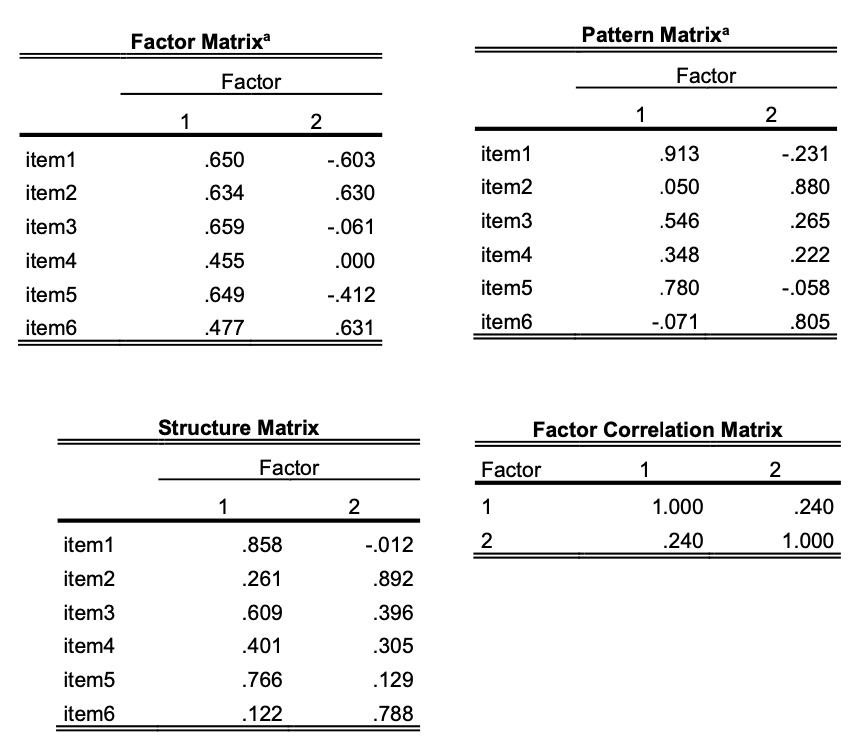

```{r, echo = FALSE, results = "hide"}
#Load package
library(exams)
library(knitr)

# add picture
include_supplement("eur-factor-104-en-img104.png", recursive = TRUE)
```


Question
========


Er werd een principale componentenanalyse uitgevoerd op zes items om het aantal factoren te extraheren. De uitvoer van SPSS wordt weergegeven in de matrices hierboven. Waarom is de factormatrix geen bruikbare matrix om de geëxtraheerde factoren te interpreteren?


Solution
========
De factormatrix geeft de factorladingen van de niet-geroteerde oplossing. Over het algemeen toont deze matrix relatief hoge ladingen op de eerste factor en lagere ladingen op de tweede, derde, enz. factor. Daarom is het moeilijk om de factoren te interpreteren op basis van de ladingen in de factormatrix.

Meta-information
================
exname: eur-factor-104-nl
extype: string
exsolution: ""
extol: 
exsection: Factor analysis, Factor analysis/Factor loadings, Factor analysis/Confirmatory factor analysis, Factor analysis/Principle component analysis
exextra[ID]: f889c
exextra[Type]: Conceptual
exextra[Program]: 
exextra[Language]: Dutch
exextra[Level]: Statistical Literacy
