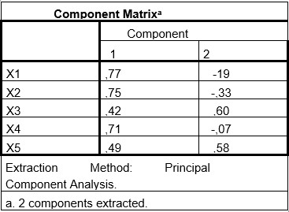

```{r, echo = FALSE, results = "hide"}
include_supplement("uu-Component-correlation-matrix-002-nl-tabel.jpg", recursive = TRUE)
```


Question
========
Op de testscores van vijf persoonlijkheidstests (X1 tot en met X5) uit een testbatterij is een hogere orde factoranalyse uitgevoerd. Hieronder de factorladingen voor de ongeroteerde twee-factoroplossing. 



Beoordeel, op basis van deze resultaten, de volgende twee uitspraken.

I. Factor 2 verklaart meer dan 10% van de totale variantie van de testbatterij met vijf persoonlijkheidstests.
II. Persoonlijkheidstest 4 is het minst indicatief voor een inhoudelijke interpretatie van factor 2.

Answerlist
----------
* I is juist, II is juist
* I is juist, II is niet juist
* I is niet juist, II is juist
* I is niet juist, II is niet juist


Solution
========
Uitleg: Stelling 1: Deze vraag betreft de verklaarde variantie van de factor. Om die te berekenen, dient eerst de eigenwaarde van de factor bepaald te worden. Om deze te berekenen kwadrateren we de factorladingen van de items op factor 2, en tellen deze op:
$(-.19)^2+(-.33)^2+ (.60)^2+(-.07)^2+(.58^2)$= .036 +.109 +.360 +.005 + .336= .846
Dit wordt vervolgens  door het aantal items gedeeld om de verklaarde variantie te krijgen:
.846/5= .169
Er wordt dus liefst 17% van de totale variantie verklaard door factor 2.

Stelling 2: Deze vraag betreft de factorlading van de items. Het item met de laagste absolute factorlading, is het minst indicatief voor een inhoudelijke interpretatie van de factor. Immers, deze laadt het slechtst op de factor. Omgekeerd: het item met de hoogste lading is het best te gebruiken als interpretatie. Item X4 laadt het laagst, met een absolute factorlading van .07.


Meta-information
================
exname: uu-Component-correlation-matrix-002-nl
extype: schoice
exsolution: 1000
exsection: Factor analysis/Component correlation matrix
exextra[Type]: Interpreting output
exextra[Program]: 
exextra[Language]: Dutch
exextra[Level]: Statistical Literacy
