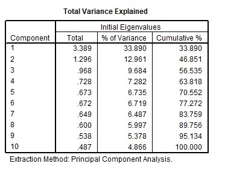

```{r, echo = FALSE, results = "hide"}
include_supplement("uu-Eigenvalues-003-nl-tabel.jpg", recursive = TRUE)
```


Question
========
  
'So many demands are placed on modern parents that they can easily develop fear of failure' (Wed., Jan. 7, 2014).

In a study of parents' insecurities and fear of failure, a collection of 10 relevant items was presented to a random sample of parents. Respondents had to indicate for each item the degree to which it applied (1 = not at all applicable to me through 7 = completely applicable to me).

Example: The responsibility of parenting is hard on me.

See the following output of a principal component analysis for ten items on parental uncertainty and fear of failure.

How many factors do you select based on the Eigenvalue criterion?




Answerlist
----------
* 1
* 2
* 3
* 4

Solution
========
  
Explanation: Eigenvalue criterion means that factor with eigenvalue higher than 1.00 are included. There are 2 factors with Eigenvalue higher than 1.00. This question concerned only the eigenvalue criterion, alternative selection criteria were not to be considered.

Meta-information
================
exname: uu-Eigenvalues-003-en
extype: schoice
exsolution: 0100
exsection: Factor analysis/Eigenvalues
exextra[Type]: Interpreting output
exextra[Program]: SPSS
exextra[Language]: English
exextra[Level]: Statistical Literacy
