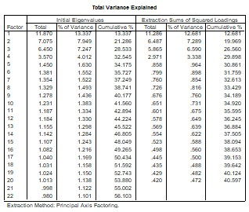
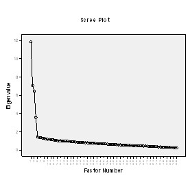

```{r, echo = FALSE, results = "hide"}
include_supplement("uu-Eigenvalues-013-nl-tabel.jpg", recursive = TRUE)
```

```{r, echo = FALSE, results = "hide"}
include_supplement("uu-Eigenvalues-013-nl-tabel2.jpg", recursive = TRUE)
```

Question
========
The SPSS output below of a factor analysis in the narrow sense (principal axis factoring) without rotation on data collected with the Achievement Motivation Test for Children (PMTK). Within this test, the creators distinguished the subscales Positive Fear of Failure, Negative Fear of Failure, Achievement Motivation and Social Desirability.

Rate the following two statements.

I. According to the Eigenvalue criterion, a four-factor solution fits the theoretically assumed internal structure of the PMTK here.

II. According to the kink criterion, a four-factor solution here fits the theoretically assumed internal structure of the PMTK.



  

  
    
Answerlist
----------
* Pronunciation I and II are both correct
* Only statement I is correct
* Only statement II is correct
* Pronunciation I and II are both incorrect

Solution
========
  
Explanation: Theorem 1: Judging by the Eigenvalue criterion, a factor solution with 20 factors fits (because: 20 factors with an eigenvalue >1.00. Theorem 2: The kink is in the scree plot at factor 5, therefore there are four factors above the kink and a factor solution with four factors fits the kink criterion.

Meta-information
================
exname: uu-Eigenvalues-013-en
extype: schoice
exsolution: 0010
exsection: Factor analysis/Eigenvalues
exextra[ID]: a977e
exextra[Type]: Interpreting output
exextra[Program]: SPSS
exextra[Language]: English
exextra[Level]: Statistical Literacy
