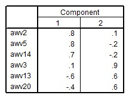

```{r, echo = FALSE, results = "hide"}
include_supplement("uu-Factor-loadings-004-nl-tabel.jpg", recursive = TRUE)
```

Question
========
  
A six-item personality test was administered to a random sample from the population of single mothers.

* AWV2 = crying
* AWV5 = dejected
* AWV14 = dullness
* AWV3 = clear thinking
* AWV13 = energetic
* AWV20 = decisive

A rotated principal component analysis yields the following loadings for the two-factor solution: 




Which item is best explained in this model?

Answerlist
----------
* AWV5
* AWV14
* AWV3
* AWV13

Solution
========
  
An item is best explained when it loads as high as possible on one factor and as low as possible (absolute value) on the other factor(s). The table shows that item AWV3 (compared to the other items) loads highest on factor 2 and lowest on factor 1. Item AWV3 is thus the most uniformly interpreted and thus best explained in this model.

Meta-information
================
exname: uu-Factor-loadings-004-en
extype: schoice
exsolution: 0010
exsection: Factor analysis/Factor loadings
exextra[Type]: Interpreting output
exextra[Program]: 
exextra[Language]: English
exextra[Level]: Statistical Literacy

