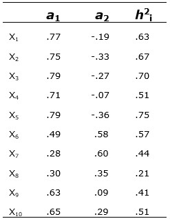

```{r, echo = FALSE, results = "hide"}
include_supplement("uu-Factor-loadings-016-nl-tabel.jpg", recursive = TRUE)
```

Question
========
  
A factor analysis was performed on the test scores of a psychological test battery consisting of ten subtests. The results of a higher-order principal component analysis (PCA) are shown below.

Which of the subtests (X2, X5, X7 or X8) fits the worst into the two-factor model?



  
Answerlist
----------
* X2
* X5
* X7
* X8

Solution
========

Meta-information
================
exname: uu-Factor-loadings-016-en
extype: schoice
exsolution: 0001
exsection: Factor analysis/Factor loadings
exextra[ID]: a883a
exextra[Type]: Interpreting output
exextra[Program]: SPSS
exextra[Language]: English
exextra[Level]: Statistical Literacy
