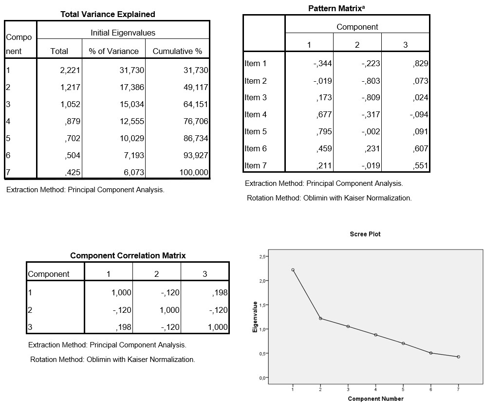

```{r, echo = FALSE, results = "hide"}
include_supplement("uu-Rotations-020-nl-tabel.jpg", recursive = TRUE)
```

Question
========
  
Marlies is writing the results section of her Bachelor thesis. She has investigated how environmentally conscious people are. She did this using a short questionnaire consisting of 7 statements of which people could indicate to what extent they agreed or disagreed with such a statement on a 5-point Likert scale.  Marlies collected data among 125 men and women in the Utrecht region. In this part of her analysis, she wants to see if her questionnaire is valid. To do this she performs a factor analysis, parts of the results of which are given below.   
  



  
What could be a reason for these researchers to use a rotation?  
  
Answerlist
----------
* Because that's the way to do factor analysis
* Because then they can interpret the results better
* Because they expect to find a correlation between the three scales
* Because they expect to find three scales

Solution
========

Meta-information
================
exname: uu-Rotations-020-en
extype: schoice
exsolution: 0100
exsection: Factor analysis/Rotations
exextra[Type]: Interpreting output
exextra[Program]: SPSS
exextra[Language]: English
exextra[Level]: Statistical Literacy
