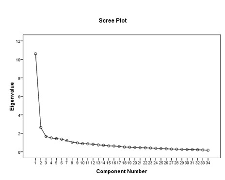

```{r, echo = FALSE, results = "hide"}
include_supplement("uu-Scree-plot-001-nl-tabel.jpg", recursive = TRUE)
```

```{r, echo = FALSE, results = "hide"}
include_supplement("uu-Scree-plot-001-nl-tabel2.jpg", recursive = TRUE)
```


Question
========
  
A group of researchers want to develop an instrument that measures how traumatized children are after experiencing a car accident. Based on existing trauma literature, they created items belonging to one of the following scales: re-experiencing, avoidance, arousal, and sleep problems. Because the children themselves are too traumatized, they are taking their 36 items from 314 parents.  Because the researchers expect four subscales, they conduct a factor analysis with 4 factors. Part of the SPSS output is below.




How many factors do we distinguish based on the scree plot? 
Answerlist
----------
* 1
* 2
* 3
* 4

Solution
========
  
The correct answer is 2.

Meta-information
================
exname: uu-Scree-plot-001-en
extype: schoice
exsolution: 0100
exsection: Factor analysis/Scree plot
exextra[Type]: Interpreting output
exextra[Program]: SPSS
exextra[Language]: English
exextra[Level]: Statistical Literacy

