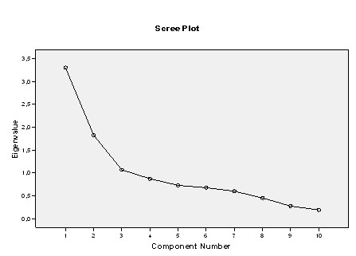
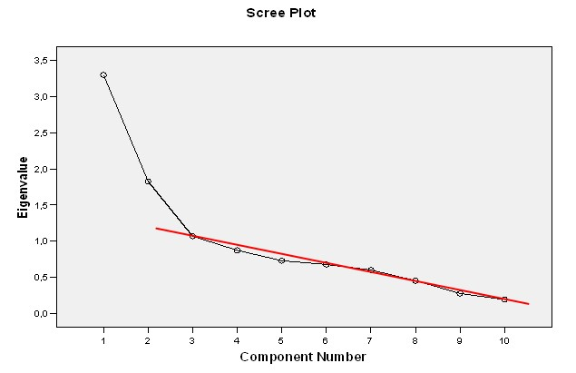

```{r, echo = FALSE, results = "hide"}
include_supplement("uu-Scree-plot-007-nl-tabel.jpg", recursive = TRUE)
```

```{r, echo = FALSE, results = "hide"}
include_supplement("uu-Scree-plot-007-nl-tabel2.jpg", recursive = TRUE)
```


Question
========
Below is the scree-plot of a principal component analysis for a ten-item scale on eating problems.


How many factors would you choose based on the scree plot?  

Answerlist
----------
* 1 factor
* 2 factors
* 3 factors
* 4 factors

Solution
========
  
We use the scree-plot to look for the transition between the first number of factors that explain a lot of variance and the factors that come after that all explain about the same amount of variance. We then choose the number of factors that lie before/above the first kink in the figure.

In this figure, based on the kink criterion, we choose 2 factors (see the additional line drawn in the figure).




Meta-information
================
exname: uu-Scree-plot-007-nl.-en
extype: schoice
exsolution: 0100
exsection: Factor analysis/Scree plot
exextra[Type]: Interpreting graph
exextra[Program]: SPSS
exextra[Language]: English
exextra[Level]: Statistical Literacy

