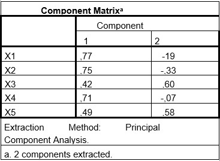

```{r, echo = FALSE, results = "hide"}
include_supplement("uu-component-correlation-matrix-002-nl-tabel.jpg", recursive = TRUE)
```


Question
========
Higher-order factor analysis was performed on the test scores of five personality tests (X1 through X5) from a test battery. Below are the factor loadings for the unrotated two-factor solution.



Based on these results, evaluate the following two statements.

I. Factor 2 explains more than 10% of the total variance of the test battery of five personality tests. II. Personality test 4 is the least indicative of a substantive interpretation of factor 2.

Answerlist
----------
* I is correct, II is correct
* I is true, II is false
* I is not correct, II is correct
* I is not right, II is not right


Solution
========
Explanation: Theorem 1: This question concerns the explained variance of the factor. To calculate it, first determine the Eigenvalue of the factor. To calculate it, we square the factor loadings of the items to factor 2, and sum them:
$(-.19)^2+(-.33)^2+ (.60)^2+(-.07)^2+(.58^2)$= .036 +.109 +.360 +.005 + .336= .846 This is then divided by the number of items to get the explained variance: .846/5= .169 Thus, no less than 17% of the total variance is explained by factor 2.

Theorem 2: This question concerns the factor loading of the items. The item with the lowest absolute factor loading, is the least indicative of a substantive interpretation of the factor. After all, it loads the worst on the factor. Conversely, the item with the highest loading is most indicative of interpretation. Item X4 loads the lowest, with an absolute factor loading of .07.

Meta-information
================
exname: uu-component correlation matrix-002-en
extype: schoice
exsolution: 1000
exsection: Factor analysis/Component correlation matrix
exextra[ID]: 051ca
exextra[Type]: Interpreting output
exextra[Program]:
exextra[Language]: English
exextra[Level]: Statistical Literacy
