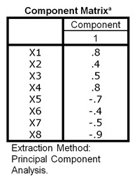

```{r, echo = FALSE, results = "hide"}
include_supplement("uu-component-correlation-matrix-012-nl-tabel.jpg", recursive = TRUE)
```


Question
========

Voor een onderzoek bij Nederlandse studenten naar 'lange tenen' en 'gevoelige snaren' zijn acht items ontwikkeld. De items X1 tot en met X4 gaan over 'lange tenen' en de items X5 tot en met X8 gaan over 'gevoelige snaren'.

De respondenten geven op een vijfpuntsschaal de mate van instemming aan (1 = geheel mee oneens tot en met 5 = geheel mee eens). Over de verzamelde gegevens is een factoranalyse uitgevoerd. De factoroplossing met één factor 'respectvolle omgang' bleek uitstekend. De factorladingen van de acht items op de factor zijn hieronder weergegeven.




Alle respondenten krijgen een factorscore F. Stel een student heeft een factorscore ver boven het gemiddelde van de groep (F > 2.5), dan is het, gegeven de factorladingen, zeer waarschijnlijk dat deze student het ...

Answerlist
----------
* eens is met de lange tenen-stellingen en het ook eens is met de gevoelige snaren-stellingen.
* eens is met de lange tenen-stellingen, maar het oneens is met de gevoelige snaren-stellingen.
* oneens is met de lange tenen-stellingen, maar het wel eens is met de gevoelige snaren-stellingen.
* oneens is met de lange tenen-stellingen en het ook oneens is met de gevoelige snaren-stellingen.


Solution
========
Uitleg: Iemand die hoog scoort op de Factor, heeft hoge scores op de items met positieve factorladingen (X1 tot en met X4) en lage scores op de items met negatieve factorladingen (X5 tot en met X8). De items X1 tot en met X4 meten de lange tenen-stellingen. Iemand die hoog scoort op Factor F scoort dus ook hoog op deze items. Een hogere score (1  = geheel mee oneens, 5 = geheel mee eens) betekent dat men het eens is met deze stellingen. Een lage score op de items X5 tot ten met X8 staan juist voor oneens zijn met de gevoelige snaren-stellingen.

Meta-information
================
exname: uu-component-correlation-matrix-012-nl
extype: schoice
exsolution: 0100
exsection: Factor analysis/Component correlation matrix
exextra[ID]: 6d171
exextra[Type]: Interpreting output
exextra[Program]: SPSS
exextra[Language]: Dutch
exextra[Level]: Statistical Literacy

