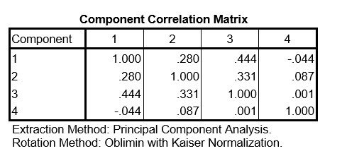

```{r, echo = FALSE, results = "hide"}
include_supplement("uu-component-correlation-matrix-023-nl-tabel.jpg", recursive = TRUE)
```

```{r, echo = FALSE, results = "hide"}
include_supplement("uu-component-correlation-matrix-023-nl-tabel2.jpg", recursive = TRUE)
```

Question
========

Een groep onderzoekers wil een instrument ontwikkelen dat meet hoe getraumatiseerd kinderen zijn na het meemaken van een auto ongeluk. Op basis van bestaande trauma literatuur hebben ze items gemaakt die bij een van de volgende schalen horen: herbeleving, vermijding, geprikkeldheid, en slaapproblemen. Omdat de kinderen zelf te getraumatiseerd zijn, nemen ze hun 36 items af bij 314 ouders.  Omdat de onderzoekers vier subschalen verwachten voeren ze een factor analyse uit met 4 factoren. Deel van de SPSS output staat hieronder.




Hoe sterk is het verband tussen factor 1 en factor 2 en hoe classificeren we dat?

Answerlist
----------
* .280 en dat is een matig-sterk verband
* .280 en dat is een zwak-matig verband
* .078 en dat is een matig-sterk verband
* .078 en dat is een zwak-matig verband

Solution
========


Meta-information
================
exname: uu-component-correlation-matrix-023-nl.Rmd
extype: schoice
exsolution: 0001
exsection: Factor analysis/Component correlation matrix
exextra[Type]: Interpreting output
exextra[Program]: SPSS
exextra[Language]: Dutch
exextra[Level]: Statistical Literacy
