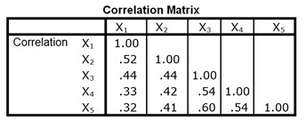
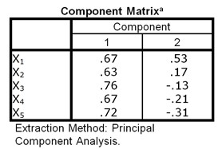

```{r, echo = FALSE, results = "hide"}
include_supplement("uu-Explained-variance-011-nl-tabel.jpg", recursive = TRUE)
```

```{r, echo = FALSE, results = "hide"}
include_supplement("uu-Explained-variance-011-nl-tabel2.jpg", recursive = TRUE)
```

Question
========
A study of internalizing and externalizing problem behaviors (X1 through X5) in rural youth resulted in the following correlation matrix: 



An unrotated principal component analysis yielded the following factor loading matrix for a two-factor solution:



What percentage of the variance in the five behaviors is explained by the first factor?

Answerlist
----------
* Less than 50%
* Between 50% and 68%
* Between 68% and 75%
* More than 5%


Solution
========


Explanation: This question asks first about Eigenvalue 
$\lambda$ of Factor 1. To calculate it, use the following formula: $\lambda =  \sum a^2_{gt}$ . We fill these in with the factor loadings on Factor 1: 

$\lambda = .67^2 + .63^2 + .76^2 + .67^2 + .72^2 = .449+ .397 + .578 + .449 + .518 = 2.391$
This is then divided by the number of items to calculate the explained variance of Factor 1: $\frac {\lambda} {k} \frac {2.391}{5} = .478.$
Factor 1 explained 47.8% of the variance of the items.

Meta-information
================
exname: uu-Explained variance-011-en
extype: schoice
exsolution: 1000
exsection: Factor analysis/Explained variance
exextra[Type]: Interpreting output
exextra[Program]: SPSS
exextra[Language]: English
exextra[Level]: Statistical Literacy
