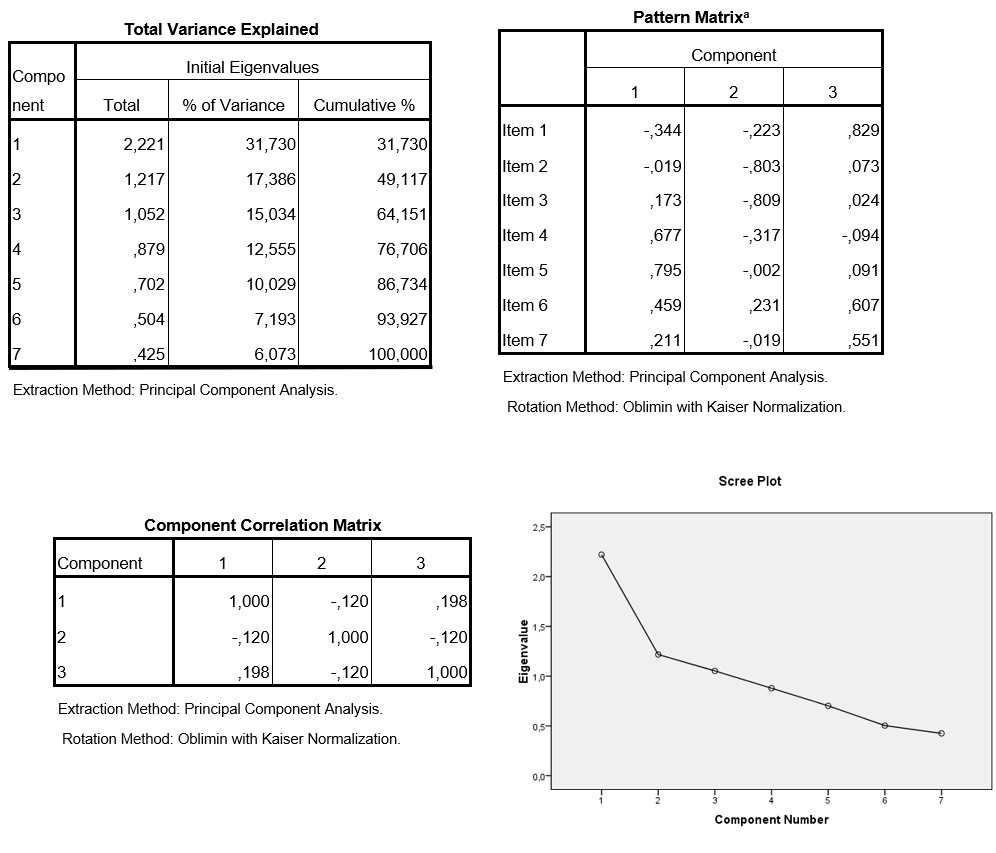

```{r, echo = FALSE, results = "hide"}
include_supplement("uu-factor-analysis-019-nl-tabel.jpg", recursive = TRUE)
```

Question
========
  
Which statement is correct about reducing the number of factors? 


  
Answerlist
----------
* Based on the percentage of variance explained, we would choose 1 factor, because 31.7% is already a good portion of the variance explained.
* Based on the factor loadings, we would choose two factors, because there is 1 item loading on 2 factors, so the two should be combined.
* Using the interfactor correlations, we would choose 3 factors, because none of the correlations squared indicate a moderate or strong relationship.
* Using the scree plot, we would choose two factors because the kink is above 2. 

Solution
========

Meta-information
================
exname: uu-factor-analysis-019-en
extype: schoice
exsolution: 0010
exsection: Factor analysis
exextra[ID]: bf300
exextra[Type]: Interpreting output
exextra[Program]: SPSS
exextra[Language]: English
exextra[Level]: Statistical Literacy
