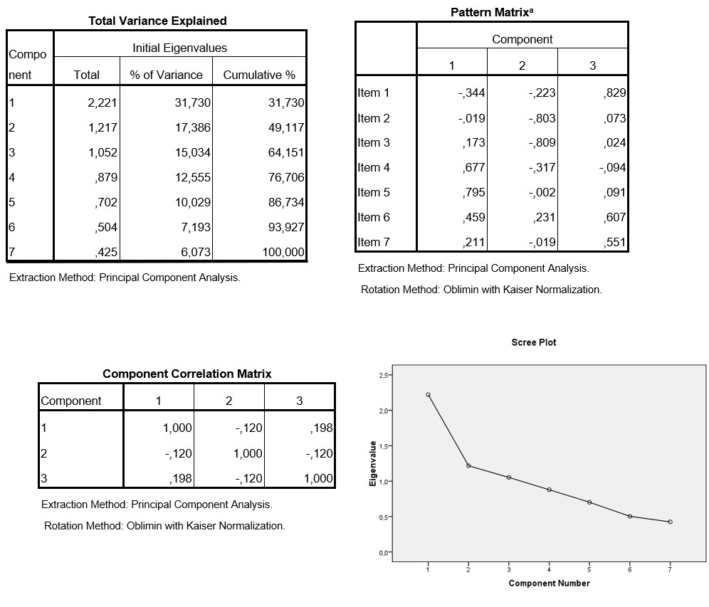

```{r, echo = FALSE, results = "hide"}
include_supplement("uu-factor-analysis-021-nl-tabel.jpg", recursive = TRUE)
```

Question
========
  
Marlies is writing the results section of her Bachelor thesis. She has investigated how environmentally conscious people are. She did this using a short questionnaire consisting of 7 statements of which people could indicate to what extent they agreed or disagreed with such a statement on a 5-point Likert scale.  Marlies collected data among 125 men and women in the Utrecht region. In this part of her analysis, she wants to see if her questionnaire is valid. To do this she performs a factor analysis, parts of the results of which are given below. 



Two of Marlies' friends read her report and made the following comments:

Lars: "In order to make a final decision on the final factor solution, I do still need to know the content/meaning of the items." Tim: "In order to make a final decision on the final factor solution, I still need to know about the expected dimensionality of the questionnaire."

Who is right?

  
Answerlist
----------
* Lars and Tim are both right
* Only Lars is right
* Only Tim is right
* Lars and Tim are neither right

Solution
========

Meta-information
================
exname: uu-factor-analysis-021-en
extype: schoice
exsolution: 1000
exsection: Factor analysis
exextra[Type]: Interpreting output
exextra[Program]: SPSS
exextra[Language]: English
exextra[Level]: Statistical Literacy
