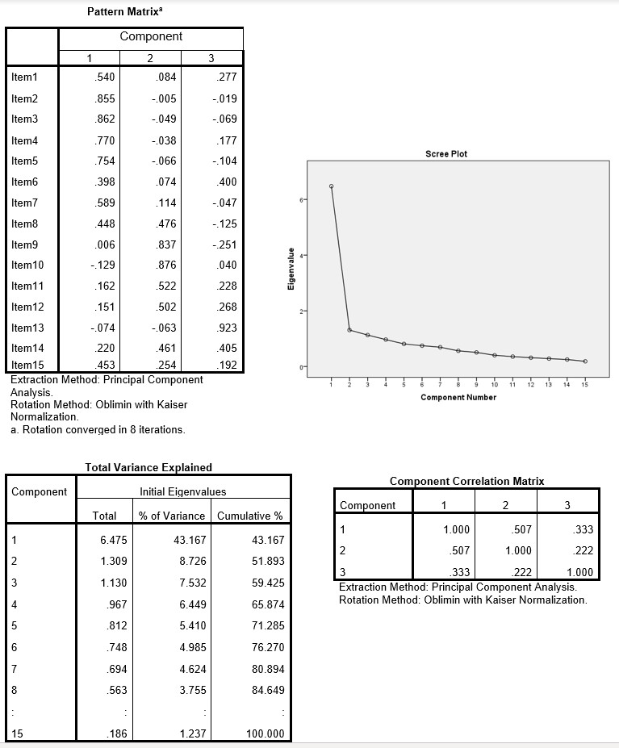

```{r, echo = FALSE, results = "hide"}
include_supplement("uu-factor-analysis-028-nl-tabel.jpg", recursive = TRUE)
```

Question
========
  
Matthijs administered a questionnaire on depression to 100 respondents. He measured depression using 15 items, but he suspects that subscales might be present. He is testing this with a factor analysis. Part of the SPSS output is below. 



Matthijs enlists the help of an expert. What information does the expert need to determine the final factor solution? 
Answerlist
----------
* The component matrix
* The content of the items
* Communalities table
* Cronbach's alpha


Solution
========

Item content.

Meta-information
================
exname: uu-factor-analysis-028-en
extype: schoice
exsolution: 0100
exsection: Factor analysis
exextra[Type]: Interpreting output
exextra[Program]: SPSS
exextra[Language]: English
exextra[Level]: Statistical Literacy
